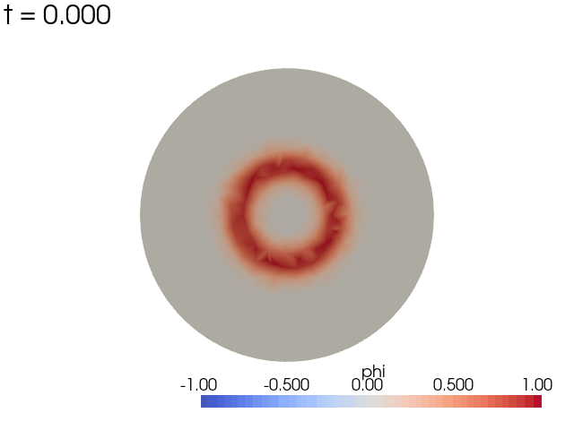

# PSYOP — Scalar Field Dynamics on Black-Hole Backgrounds

[](https://github.com/mgr16/relativistic-scalar-dynamics/actions/workflows/ci.yml)
[](https://github.com/mgr16/relativistic-scalar-dynamics/actions/workflows/core.yml)


PSYOP is a 3D finite-element simulator for scalar fields evolving on fixed
black-hole backgrounds, built on [FEniCSx/DOLFINx](https://fenicsproject.org/).
It solves the Klein–Gordon equation in first-order 3+1 form with SSP-RK3 time
integration, characteristic (Sommerfeld) absorbing boundaries, horizon
excision, and quasinormal-mode (QNM) analysis.



*Live view (`psyop run --live`): an outgoing Gaussian pulse on the z=0 slice
of a spherical domain, absorbed by the characteristic boundary condition.*

> **Physical assumption**: the scalar is a test field on a fixed background
> (Cowling approximation) — no backreaction on the metric.

## Features

**Physics**
- Backgrounds: flat, Schwarzschild (isotropic), Kerr (Kerr–Schild), with
  symbolic extrinsic curvature K
- Potentials: quadratic, Higgs (`½m²φ² + ¼λφ⁴`), Mexican hat, zero
- Initial data: Gaussian bump with consistent ingoing/outgoing/static
  momentum, plus `ingoing_curved` (momentum consistent with the curved
  background — less spurious junk radiation)

**Numerics**
- First-order reduction (φ, Π) with SSP-RK3 and CFL-adaptive timestep
- Preassembled linear-operator fast path with exact nonlinear remainder
  (×4.2 linear / ×2.1 Higgs RHS at 262k cells)
- Lagrange P1–P5 elements (DOLFINx), PETSc mass-matrix solves
- Characteristic Sommerfeld absorbing boundary; horizon excision
  (`mesh.r_inner > 0`) with inner "do-nothing" boundary, validated against
  the spin-dependent admissible excision window on Kerr–Schild
- Sponge layer for dispersive tails of massive fields
- Kreiss–Oliger dissipation (2nd or 4th order, λmax-normalized)
- Gmsh spherical/shell meshes with radial grading (`lc_inner`) and optional
  curved second-order cells (`mesh.geom_order = 2`)

**Analysis & output**
- Point sampling, multipole (real Yₗₘ) extraction on a sphere
- Energy/flux series with discrete energy-balance residual; on excised
  domains `flux.csv` also records the horizon absorption flux (`flux_inner`)
- QNM spectra via FFT or Prony; XDMF fields + CSV series + run manifest
- **Leaver reference QNMs**: continued-fraction solver for scalar Kerr
  quasinormal frequencies, any (l, m, n, spin) — no lookup tables needed
- **Cowling validity monitor**: quantifies the test-field approximation
  (ζ = 8πρ/√K per step) and warns when backreaction would matter
- **Astrophysical units**: QNM output in Hz/ms for a chosen mass in M☉
- **Price tail analysis**: late-time power-law fits with quality measure
- **1D reference oracle** (`psyop.reference`): spherical l-mode solver on
  Schwarzschild–Kerr-Schild for cross-validating the 3D pipeline

**Visualization**
- Interactive live view of φ during evolution (`--live`, PyVista)

See [CHANGELOG.md](CHANGELOG.md) for what's new in 3.2.

## Project Structure

```
psyop/
├── src/psyop/             # Main package
│   ├── analysis/          # QNM (FFT/Prony), multipole extraction
│   ├── backends/          # DOLFINx numerical abstractions
│   ├── mesh/              # Gmsh ball/shell meshes, boundary tags, grading
│   ├── physics/           # Metrics, potentials, initial conditions
│   ├── reference/         # 1D spherical oracle (cross-validation)
│   ├── solvers/           # First-order KG solver (SSP-RK3)
│   ├── utils/             # CFL, logging, live PyVista viewer
│   ├── cli.py             # `psyop run` / `psyop postprocess`
│   └── config.py          # Defaults, loading, validation
├── tests/                 # Pytest suite (markers: slow, mpi, requires_dolfinx, ...)
├── docs/
│   ├── math/              # 3+1 derivation and conventions
│   ├── media/             # README assets (live demo GIF)
│   ├── research/          # Research program (Fase 0 report, data, figures)
│   └── validation/        # Validation & reproducibility summary
├── scripts/               # Env setup, profile runner, demo GIF recorder
├── benchmarks/            # Solver benchmarks
└── config_example.json    # Example configuration
```

## Installation

DOLFINx is required and is installed via conda.

### Option A — automated script
```bash
./scripts/setup_conda_env.sh --yes
# variants:
./scripts/setup_conda_env.sh --env-name psyop-dolfinx --python 3.10 --yes
./scripts/setup_conda_env.sh --install-dev --yes
```
The script creates (or reuses) a conda environment, installs `fenics-dolfinx`
and dependencies from conda-forge, installs the package in editable mode, and
validates critical imports.

### Option B — manual
```bash
conda create -n psyop-dolfinx python=3.10
conda activate psyop-dolfinx
conda install -c conda-forge fenics-dolfinx gmsh numpy scipy petsc4py
pip install -e .
```

Optional extras:

| Extra | Installs | For |
|---|---|---|
| `pip install -e .[viz]` | pyvista | live visualization (`--live`) |
| `pip install -e .[analysis]` | matplotlib | postprocess plots |
| `pip install -e .[dev]` | pytest, ruff, mypy, ... | development |

> **macOS note**: if the FFCx JIT fails with
> `ld: -lto_library library filename must be 'libLTO.dylib'`, the conda-forge
> clang is conflicting with Xcode's linker. Use the system compiler for the JIT:
> ```bash
> export CC=/usr/bin/clang
> ```
> (add it to your shell profile or the environment activation.)

### Verify the installation
```bash
pytest -q          # imports, config, lightweight postprocess tests
psyop --test       # CLI smoke check
```

## Quick Start

### Basic simulation
```bash
psyop run --config config_example.json --output results
```

Compatibility aliases are also installed:
```bash
psyop-run --config config_example.json --output results
psyop-postprocess --run results/run_YYYYmmdd_HHMMSS --qnm --method fft
```

### Live visualization (`--live`)
Opens an interactive PyVista window with a z=0 slice of φ that updates during
the evolution (fixed color bar calibrated to the initial state, simulation
time on screen). Requires pyvista:

```bash
conda install -n psyop-dolfinx -c conda-forge pyvista   # or: pip install -e .[viz]
```

```bash
psyop run --config config_example.json --live                 # refresh every output_every steps
psyop run --config config_example.json --live --live-every 5  # refresh every 5 steps
```

Caveats:
- Intended for demos and debugging, **not production**: rendering slows down
  the evolution loop.
- **Serial only**: with MPI > 1 rank the viewer is disabled with a warning and
  the simulation continues normally.
- Needs a graphical session: in headless environments, or if pyvista is not
  installed, a warning is logged and the run continues without a window
  (without `--live` the cost is zero).

To regenerate the README demo GIF: `python scripts/record_live_demo.py`.

### QNM postprocessing
```bash
psyop postprocess --run results/run_YYYYmmdd_HHMMSS --qnm --method fft --plots
```

### Custom configuration
Edit `config_example.json` or create your own JSON with the same keys:

```json
{
    "mesh": {
        "type": "gmsh",
        "R": 15.0,
        "lc": 1.0,
        "r_inner": 0.0
    },
    "metric": {
        "type": "flat",
        "M": 1.0
    },
    "solver": {
        "degree": 1,
        "cfl": 0.3,
        "potential_type": "higgs",
        "potential_params": {
            "m_squared": 1.0,
            "lambda_coupling": 0.1
        },
        "bc_type": "characteristic",
        "enable_sommerfeld": true
    },
    "evolution": {
        "t_end": 20.0,
        "output_every": 10
    }
}
```

For black-hole backgrounds set `metric.type = "schwarzschild"` or `"kerr"` and
`mesh.r_inner > 0` (excision); validation enforces this and suggests values
(`~M/2` for isotropic Schwarzschild). For Kerr–Schild, `r_inner` must lie in
the spin-dependent admissible window (√(r₋² + a²), r₊) — enforced by
validation and derived in
[docs/math/excision_window.md](docs/math/excision_window.md). Use
`mesh.lc_inner < mesh.lc` to refine radially near the horizon.

Advanced solver options:

| Key | Description |
|---|---|
| `solver.sponge {enabled, width, strength}` | Sponge layer damping dispersive tails near the outer boundary. Width should be comparable to the wavelength to absorb — a narrow, strong sponge reflects slow modes instead of absorbing them. |
| `solver.ko_eps`, `solver.ko_order` | Kreiss–Oliger dissipation (order 2 or 4). The 4th-order biharmonic filter barely touches smooth modes. |
| `initial_conditions.direction` | `"ingoing"` / `"outgoing"` (pure spherical pulse, Π = ±(∂ᵣφ + φ/r)), `"static"` (Π = 0, pulse splits in halves), or `"ingoing_curved"` (Π consistent with the curved background — suppresses spurious junk radiation). |
| `mesh.geom_order` | Geometric order of the cells: 1 (default, flat facets) or 2 (curved cells; use when the boundary-geometry error would dominate at high resolution). |
| `analysis.extraction {enabled, radius, lmax}` | Multipole projection of φ onto real Yₗₘ on an extraction sphere → `series/multipoles.csv`. |
| `analysis.qnm_method`, `analysis.qnm_modes` | `"fft"` or `"prony"` QNM estimation. |
| `output.physical_units {M_solar}` | Report QNM results in physical units (Hz, ms) for a black hole of the given mass → `series/qnm_physical.json`. A 30 M☉ remnant rings at ~521 Hz (LIGO band). |

## Physics and Numerical Methods

**First-order system** (3+1 form, lapse α, shift β):
```
Π   = (∂tφ − β·∇φ)/α
∂tφ = αΠ + β·∇φ
∂tΠ = αDᵢDⁱφ + DⁱαDᵢφ + β·∇Π + αKΠ − αV'(φ)
```

**Characteristic (Sommerfeld) outflow condition**, implemented as an outgoing
flux in the weak boundary term with metric weights α√γ:
```
c_out = α − β·n
```

**SSP-RK3 integration:**
```
u⁽¹⁾ = uⁿ + dt·L(uⁿ)
u⁽²⁾ = ¾uⁿ + ¼u⁽¹⁾ + ¼dt·L(u⁽¹⁾)
uⁿ⁺¹ = ⅓uⁿ + ⅔u⁽²⁾ + ⅔dt·L(u⁽²⁾)
```

**Adaptive CFL condition:**
```
dt = CFL_factor × h_min / (c_max × degree²)
```
where `h_min` is the minimum cell size, `c_max` the maximum characteristic
speed of the background, and `degree²` the standard scaling for high-order
elements.

**Energy balance**: `series/balance.csv` records `E(t) + ∫F dt − E(0)`
(outgoing flux positive); the residual converges ~h² and a >10% residual
triggers a warning (note: a sponge layer breaks this balance by design).
On excised domains the balance also includes the inner (horizon) flux,
currently a qualitative diagnostic — see
[docs/research/phase0/report.md](docs/research/phase0/report.md), §5.

Full derivation and conventions: [docs/math/3p1_scalar_field.md](docs/math/3p1_scalar_field.md).
Validation and reproducibility summary: [docs/validation/summary.md](docs/validation/summary.md).

## Output Files

```
results/run_YYYYmmdd_HHMMSS/
├── config.json              # exact configuration used
├── manifest.json            # git commit, versions, host, MPI size
├── fields/
│   └── phi_evolution.xdmf   # φ snapshots (ParaView)
├── series/
│   ├── time_series.csv      # φ at the sample point
│   ├── energy.csv, flux.csv, balance.csv
│   ├── multipoles.csv       # if extraction enabled
│   └── qnm_spectrum.csv / qnm_peak.json / qnm_modes.json
└── plots/
    └── qnm_spectrum.png     # optional (postprocess --plots)
```

## Testing and CI

```bash
# fast suite (no slow/MPI tests); macOS: prepend CC=/usr/bin/clang
pytest -q -m "not slow and not mpi"

# everything
pytest -q
```

Markers: `slow`, `mpi`, `integration`, `requires_dolfinx`, `requires_mesh`,
`requires_numpy`. Three GitHub Actions workflows:

### Physics validation ladder

The test suite validates physics at increasing depth (deepest are `slow`):

1. **Conventions & conservation** — energy balance E(t) + ∫F dt = E(0)
   (residual converges ~h²), multipole extraction against analytic Yₗₘ
   fields, Sommerfeld reflection coefficients.
2. **Reference frequencies** — the Leaver continued-fraction solver is
   checked against published Schwarzschild values (Berti et al. 2009) and
   cross-validated against the `qnm` package to machine precision.
3. **End-to-end spectroscopy** (`slow`) — full FEM evolutions on Kerr-Schild
   backgrounds with excision must reproduce Leaver frequencies: the
   Schwarzschild l=1 fundamental, and the prograde/retrograde frame-dragging
   splitting at a = 0.9 (an 80% effect, immune to discretization systematics
   in the ratio).
4. **Late-time tails** (`slow`) — after the ringdown, the field must decay
   as the Price power law t^-(2l+3) on a causally clean domain.
5. **Honesty checks** — every run logs the Cowling validity measure; the
   suite asserts it scales as A² and warns at the right threshold.

- **Core CI** — lightweight tests without DOLFINx (pure NumPy/SciPy paths)
- **CI** — full suite inside the `dolfinx/dolfinx:stable` container
- **HPC CI** — scheduled weekly run including `slow` tests

## Extending PSYOP

**New potential** (`src/psyop/physics/potential.py`): implement a class with
`evaluate(phi)` and `derivative(phi)` and register it in `potential_map`.

**New initial condition** (`src/psyop/physics/initial_conditions.py`): provide
`get_function()` and `get_momentum()` returning DOLFINx functions.

**Solver internals** (`src/psyop/solvers/first_order.py`): key methods are
`ssp_rk3_step()` (time integration), `_sommerfeld_boundary_term()` (boundary
conditions), and `_assemble_rhs_and_solve_du()` (RHS evaluation/solve).

## Troubleshooting

| Symptom | Cause / fix |
|---|---|
| `ImportError: dolfinx` | Install via conda: `conda install -c conda-forge fenics-dolfinx` |
| `Gmsh not available` | `conda install -c conda-forge gmsh` (box-mesh fallback exists, but excision/grading require Gmsh) |
| macOS JIT error `libLTO.dylib` | `export CC=/usr/bin/clang` (see Installation) |
| Solver divergence | Reduce `solver.cfl` or refine `mesh.lc` |
| Out of memory | Coarsen `mesh.lc` or run with MPI |

## References

- Gottlieb, Shu & Tadmor (2001), *Strong Stability-Preserving High-Order Time
  Discretization Methods*
- Engquist & Majda (1977), *Absorbing boundary conditions for numerical
  simulation of waves*
- Berti, Cardoso & Starinets (2009), *Quasinormal modes of black holes and
  black branes*
- Brenner & Scott, *The Mathematical Theory of Finite Element Methods*

## License

Apache License 2.0 — see [LICENSE](LICENSE).
