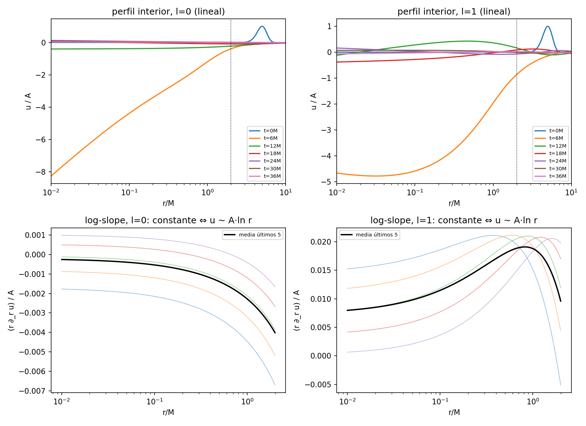
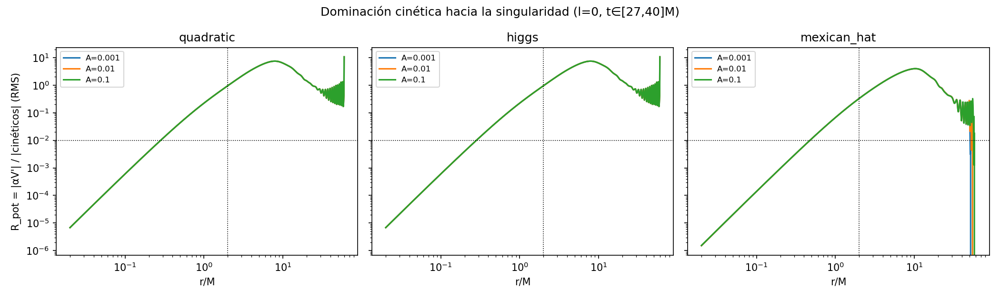
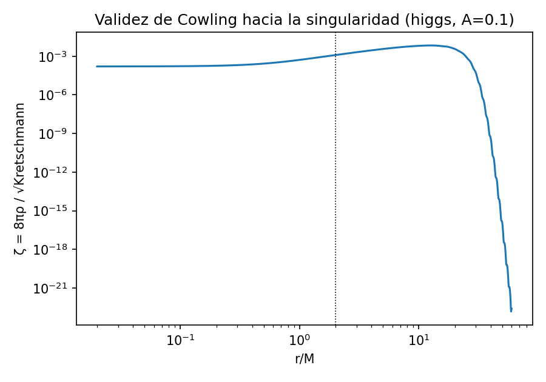
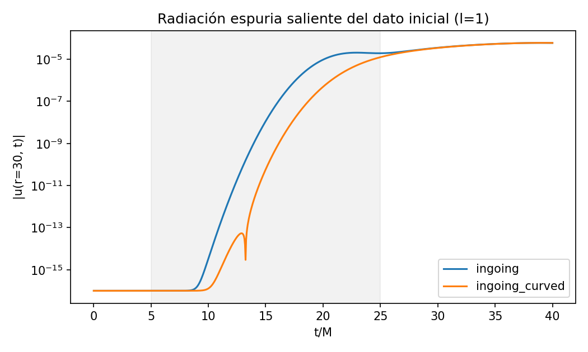

# Fase 0 — Informe de viabilidad y decisión GO/NO-GO (hipótesis H2)

**Fecha:** 2026-07-07 (corridas del 2026-06-12/13; interpretación y cierre 2026-07-07)
**Commit base:** `9597a72` + árbol de trabajo de Fase 0/1 (sin commitear)
**Entorno:** conda `rsd-dolfinx` — dolfinx 0.10.0, petsc4py 3.24.4, Python 3.10.19, macOS (`CC=/usr/bin/clang`)

## 1. Hipótesis y alcance

**H2 (titular):** *la dominación cinética cerca de la singularidad de Schwarzschild
borra la estructura de vacío tipo Higgs; se recuperan asintóticas logarítmicas
lineales* (à la Fournodavlos–Sbierski; el enunciado exacto se verificará en el
pase de literatura de Fase 2).

Todo el programa trabaja en aproximación de Cowling (campo de prueba sobre
fondo fijo); su validez se monitorea cuantitativamente (§3.3) y se declarará
como límite explícito del estudio.

Esta fase responde una sola pregunta: **¿es el programa viable y medible con
esta infraestructura?** Cuatro sub-preguntas: (i) ¿el solver 3D es estable con
excisión profunda r_inner → 0.1M?, (ii) ¿el observable de H2 está bien definido
y es medible?, (iii) ¿Cowling aguanta en el régimen de interés?, (iv) ¿los
costos son manejables?

## 2. Metodología

- **Oráculo 1D** (`rsd.reference.spherical1d`): reducción esférica exacta por
  modos l sobre Schwarzschild–Kerr-Schild, variables (φ, Π), malla log/uniforme,
  RK4 + disipación KO. Validado contra Leaver: QNM fundamental l=1 (0.1 % en
  Re ω, 1.9 % en Im ω) y l=2 (1 %, 2.2 %); 19 tests. Lecciones incorporadas:
  la velocidad entrante en KS es exactamente 1; el ring llega con retardo tipo
  tortuga (las ventanas de ajuste se anclan al pico detectado); el QNM l=0 es
  mal condicionado (Q≈0.5) — la validación cuantitativa usa l=1,2.
- **Piloto 1D** (`scripts/pilot_phase0_oracle.py`, 4047 s de pared, modo
  completo): cuatro estudios sobre r ∈ [0.01–0.02, 60]M, pulso gaussiano
  entrante desde r₀=5M con dato inicial `ingoing_curved`.
- **Sondas 3D A/B/C** (`scripts/phase0_probes/`): campo sin masa sobre
  Schwarzschild (a=0), bola R=15M con excisión, malla graduada
  (lc=1.2, lc_inner ∝ r_inner), P1, CFL 0.3, A=10⁻³.

## 3. Resultados del piloto 1D

### 3.1 Asintótica logarítmica interior (campo lineal)

Medimos s(r,t) = r·∂_r u en la zona profunda (r < 0.2M): s constante en r ⇔
u ~ a(t)·ln r + b(t).

| fase | l=0 | l=1 |
|---|---|---|
| activa (t≈5–8M) | s/A hasta −2.08; planitud espacial 6–13 % | s/A hasta −1.14; planitud 8–9 % |
| post-transitoria (t≈16–28M) | planitud 0.1–4 % con s/A decayendo 0.031→0.016 | planitud 1.8 % en t=23M |

El interior se organiza en un perfil logarítmico durante la fase activa (dos
décadas en r) y, tras el paso del pulso, mantiene la log-linealidad espacial
al nivel de ~1 % mientras la amplitud a(t) decae (la cola de Price alimenta el
horizonte). **El observable de H2 — el perfil de log-slope a(t) — está bien
definido y es medible.** Para la pregunta Higgs el campo debe *empezar* en el
vacío (u∞ = v). La zona logarítmica se extiende hasta r ≈ 0.5M, de modo que a
3D le basta r_inner ≈ 0.25M.

### 3.2 Dominación cinética hacia la singularidad

R_pot(r) = |αV′(u)|_RMS / |términos cinéticos|_RMS, promediado sobre
t ∈ [27,40]M, l=0. El r* reportado abajo es el **crossover interior**
recomputado de los datos guardados (mayor radio bajo el cual R_pot < 10⁻²
de forma contigua hasta r_min); el campo `r_star` del JSON del piloto capturó
el cruce *exterior* cercano a la frontera y no debe usarse.

| potencial | r*_int | R_pot(r_min=0.02M) | R_pot(2M) | escala profunda |
|---|---|---|---|---|
| quadratic (m²=1) | 0.281M | 6.8×10⁻⁶ | 0.95 | R_pot ~ r^2.78 |
| higgs (m²=1, λ=0.1) | 0.281M | 6.8×10⁻⁶ | 0.95 | R_pot ~ r^2.78 |
| mexican_hat (λ=0.1, v=1, u∞=v) | 0.474M | 1.5×10⁻⁶ | 0.33 | R_pot ~ r^2.79 |

- **Invariancia en amplitud:** para A ∈ {10⁻³, 10⁻², 10⁻¹} las curvas colapsan;
  R_pot(r_min) varía < 2×10⁻⁴ relativo entre la amplitud mínima y la máxima
  (p. ej. higgs: 6.8077×10⁻⁶ → 6.8088×10⁻⁶). La no-linealidad del potencial es
  invisible en el interior profundo.
- El potencial **sí** importa fuera (R_pot alcanza ~7 en r ≈ 8–10M): el borrado
  es específico del interior, no un artefacto de amplitudes pequeñas.
- mexican_hat con el campo en su vacío tiene masa efectiva m²_eff = 2λv² = 0.2,
  consistente con su R_pot menor (0.33 vs 0.95 en 2M) y su r* mayor.

**Núcleo de H2 confirmado en el sector esférico:** los términos cinéticos
dominan al potencial con supresión ~r^2.8, de forma independiente del
potencial y de la amplitud.

### 3.3 Validez de Cowling hacia el interior

Caso más exigente del piloto (higgs, A=0.1): ζ = 8πρ/√Kretschmann alcanza su
máximo global 6.9×10⁻³ en r ≈ 12.6M (la región del pulso), cae a 1.2×10⁻³ como
máximo dentro del horizonte y se aplana en ~1.6×10⁻⁴ en r_min. **La
aproximación de campo de prueba mejora hacia la singularidad** (la curvatura
crece como r⁻³ más rápido que ρ) y queda por debajo del umbral de advertencia
del monitor (10⁻²) en todo el dominio para A ≤ 0.1.

### 3.4 Radiación espuria del dato inicial

En la ventana de junk puro (t ∈ [5,25]M en r=30M, antes de que llegue
backscatter físico), la relación de momento consistente con Kerr-Schild
(`ingoing_curved`) reduce el transitorio espurio de 2.06×10⁻⁵ a 1.24×10⁻⁵
(**supresión ×1.67**) y retrasa su frente ~3M. El backscatter físico posterior
(t > 25M) coincide entre ambos, como debe.

## 4. Sondas 3D de estabilidad del interior profundo

Las tres sondas corrieron estables hasta su t_end, con energía acotada y
decayente tras la absorción del pulso (commit `9597a72`, serie
`results/phase0_probes/`):

| sonda | r_inner | lc_inner | t_end | costo de pared |
|---|---|---|---|---|
| A | 0.50M | 0.12 | 20M | ~137 s |
| B | 0.25M | 0.08 | 12M | ~158 s |
| C | 0.10M | 0.04 | 6M | ~225 s |

Con la zona logarítmica llegando a r ≈ 0.5M (§3.1), la configuración de
producción (r_inner = 0.25M, tipo sonda B) tiene margen y costo moderado.

## 5. Diagnóstico de flujo interior (estado: cualitativo)

Validación del término advectivo −(β·n)ρ añadido a `inner_flux()`
(configuración de sonda B; E₀ = 3.82×10⁻⁴, ΔE = 3.73×10⁻⁴ absorbida):

| versión | ∫flux dt | residual de balance | veredicto |
|---|---|---|---|
| conormal-only | −2.5×10⁻⁵ (−7 % de ΔE, signo erróneo) | −4.0×10⁻⁴ | no captura la absorción |
| + advectivo | +1.48×10⁻³ (+397 % de ΔE, signo correcto) | +1.1×10⁻³ | sobrecuenta ~4× |

El término advectivo es necesario (fija el signo y el orden de magnitud) pero
el balance no cierra con ninguna de las dos formas: la energía euleriana
∫ρ dV no es conservada por un flujo de superficie simple. **El cierre exacto
requiere el diagnóstico de energía de Killing (T_ab ξ^a n^b) — trabajo de
Fase 1.** Mientras tanto `flux_inner` debe tratarse como indicador cualitativo.
Esto no afecta la decisión GO: es un diagnóstico, no la evolución.

**Resuelto (2026-07-07, mismo día):** se implementó la **energía de Killing**
(ξ = ∂_t; derivación en `docs/math/killing_energy.md`, serie
`series/killing.csv`, tests en `tests/test_killing_energy.py`). Validación:

- Oráculo 1D, pulso a través del horizonte: ∫F_inner = **1.000·E₀** con
  residual 3.2×10⁻⁴·E₀ que converge exactamente a 2.º orden.
- 3D, escalera lc=1.6→1.2→0.9: el residual de Killing cae
  13.0% → 7.5% → 3.9% (≈2.º orden), mientras el euleriano converge a su
  término de producción de volumen (−4.3% → −8.6%): no puede cerrar.
- En la configuración de la propia sonda B: residual de Killing **11.0%**
  vs **290%** del euleriano en la misma corrida (×26).

El balance de referencia en runs con excisión es desde ahora el de Killing;
el `flux_inner` euleriano queda como indicador cualitativo.

## 6. Estado de la suite de tests

`pytest -q -m "not slow and not mpi"`: **129 verdes** (85 s), incluyendo los
módulos nuevos de Fase 0/1: oráculo 1D (19), fast path A/B (5), ventana de
excisión (7), dato inicial curvo (5), malla geom_order=2 (3, primera
ejecución).

## 7. Decisión

**GO para H2.** Los cuatro criterios de viabilidad se cumplen:

1. Estabilidad 3D con excisión profunda hasta r_inner = 0.1M. ✓
2. Observable bien definido y medible (perfil log-slope a(t); planitud ~1–10 %). ✓
3. Cowling válido con margen ≥ 5× bajo el umbral en el peor caso (A=0.1). ✓
4. Costos manejables (sondas 137–225 s; fast path ×4.2 en lineal, ×2.1 higgs). ✓

**Parámetros recomendados para F1/F2:** r_inner = 0.25M, dato inicial
`ingoing_curved` con u∞ = v (pregunta Higgs), amplitudes A ≤ 0.1, validación
QNM con l = 1,2 (nunca l=0), ventanas de ajuste ancladas al pico del ring.

## 8. Riesgos y trabajo diferido

- **Extrapolación 1D→3D:** la dominación cinética y el perfil log se midieron
  en el sector esférico; F2 debe reproducirlos con diagnósticos interiores 3D.
- ~~Flujo interior sin cierre cuantitativo~~ → resuelto con la energía de
  Killing (§5, actualización del 2026-07-07).
- **Honestidad de la disipación:** renombrar KO→filtro y cuantificar su efecto
  en los observables (F1).
- Escalera de convergencia (`scripts/convergence_study.py`) en ejecución al
  cierre de este informe; resultados en `docs/research/phase1/convergence/`.
- r* del JSON del piloto es el cruce exterior (artefacto de definición, §3.2);
  si se re-corre el piloto, corregir la búsqueda para reportar el crossover
  interior directamente.
